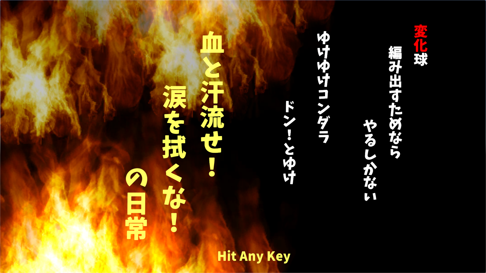
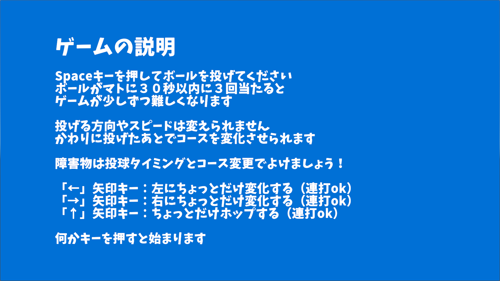
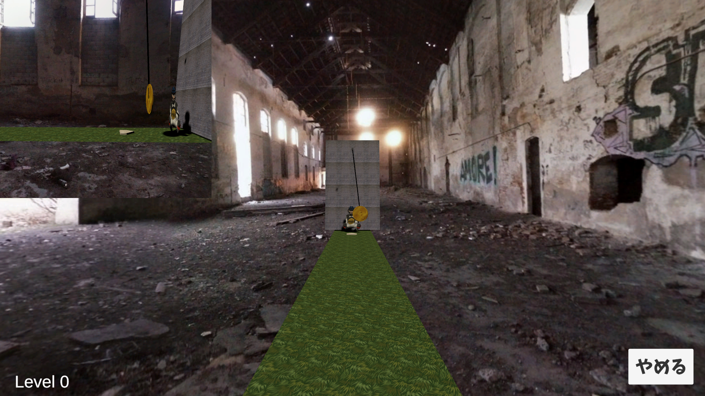
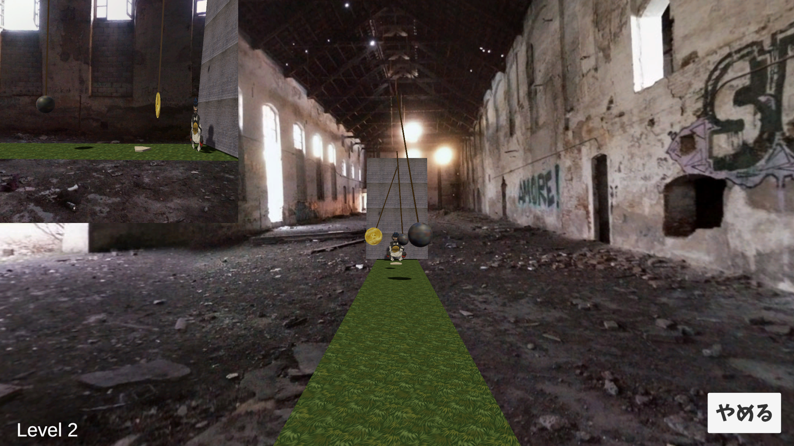

# ・１１月のテーマ
「変化」
これを「へんか」と読むのか、「へんげ」と読むのか悩ましいところですが、
とりあえず「へんか」と読むことにします。

某アニメのオマージュです。

# ・ゲーム画像

## ・ゲーム開始画面

## ・ゲーム中画面

冒頭の説明文

ターゲットはHinjeJointで振り子運動を再現

障害物は運動方程式の差分解で実装。HinjeJointと異なり振幅減衰が無い。

# ・ゲームの概要

１．サマリー

将来的なインダストリアル応用に向けて、物理演算が中心となった３Ｄゲームを作成します。
今回使用する物理演算は、「放物線運動」と「円運動」とします。
ここでの「放物線運動」はボールの飛翔、「円運動」は振り子です。

プレイヤーは、概ね１８ｍ先で揺れる振り子に向かってボールを投擲します。
ボールの初速は、概ね毎秒１０ｍ程度であり、重力の影響を受けます。
振り子の錘は、釣り竿の先端から糸で吊るされています。
振り子は、重力を含むさまざまな外力により運動を続けます。

投擲したボールを振り子の錘に当てることがこのゲームの目的です。

ただし、プレーヤーは、高い確率で当てなければなりません。

２．ゲームオブジェクト

・ボール
　直径：74mm
　質量：145g

・振り子（大中小）
　直径：400mm ～ 40mm
　質量：調整する

・釣り竿
　長さ：2.7m

・壁
　全幅：10m程度
　全高：10m程度
　質量：十分に大きい
　外見：中央に捕手の絵が掛かれている

・ホームベース
　幅（プレーヤーに面する辺）：430mm
　長さ（奥行き）:430mm
　形状：五角形
　性質：地面に描かれた模様であり、雰囲気を出すためのもの

３．ゲームの進行

３．１ 目的

ボールを投擲し、的である振り子に当てる。
ボールは、投擲後も軌道干渉することができる。

３．２ 投擲

任意のタイミングで「Space」キーを押下するとボールを投擲できる。
ボールの射出位置は固定値（0.3，1.8，0）である。
ボールの初速度は固定値（0, 0, 10）である。
飛翔中も「Space」キーを押下することでボールは初期位置に戻り飛翔を開始する。
ボールに働く重力は地球より小さい。重力加速度でおおよそ0.5m/s/sとする。（調整項目）
こうすることでボールの軌道を直線に近づける。（18m先で約1mの落下）

３．３ 軌道干渉

プレーヤーは、矢印キーを押下することでボールの運動に干渉することができる。
使用できるキーは、左/上/右の３種類とする。
矢印キーを押下することで、矢印の方向へ押下１回に付き0.03N/sのインパルスを付与する。

３．４ あたり判定

振り子の錘にはコライダーが付いており、ボールがあたるとあたり状態となる。
あたり状態が連続すると錘の色が変化してゆき、連続で３回当たると一回り小さい的に変化する。
的には、大中小の三種類があり、一番小さい的に３回連続で当たるとゲームクリアである。

３．５ 振り子運動

振り子は、初期状態では、左右にゆっくりと揺れている。
ボールが当たるなどの外力が加わると軌道がずれる。
HingeJointで実装予定であるが、時間があれば運動方程式の差分解で実装する。（振れすぎ対策未決なので）

４．その他

恐らくバッターボックスの位置に仮想的が居て、妨害行為を行うべきなので、
プレーヤーは、投擲タイミングの調整や軌道干渉により、妨害を避ける必要がある。

－以上－
